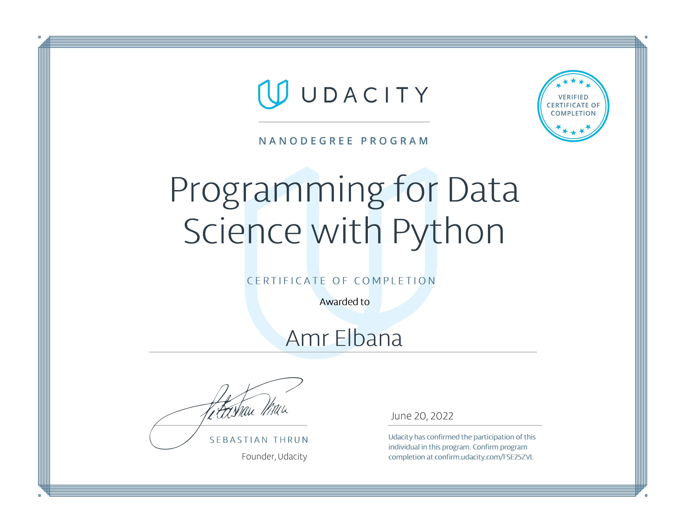

#### By: Amr Elbana
#### Created at: 20/06/2022

###### Introduction to SQL
Learn SQL language fundamentals such as building basic queries and advanced functions like Window Functions, Subqueries and Common Table Expressions.

###### Command Line Essentials
The Unix shell is a powerful tool for developers of all sorts. In this lesson, you'll get a quick introduction to the very basics of using it on your own computer.

###### Python
Learn Python programming fundamentals such as data types and structures, variables, loops, and functions.

###### Version Control
Learn how to use version control to save and share your projects with others.

